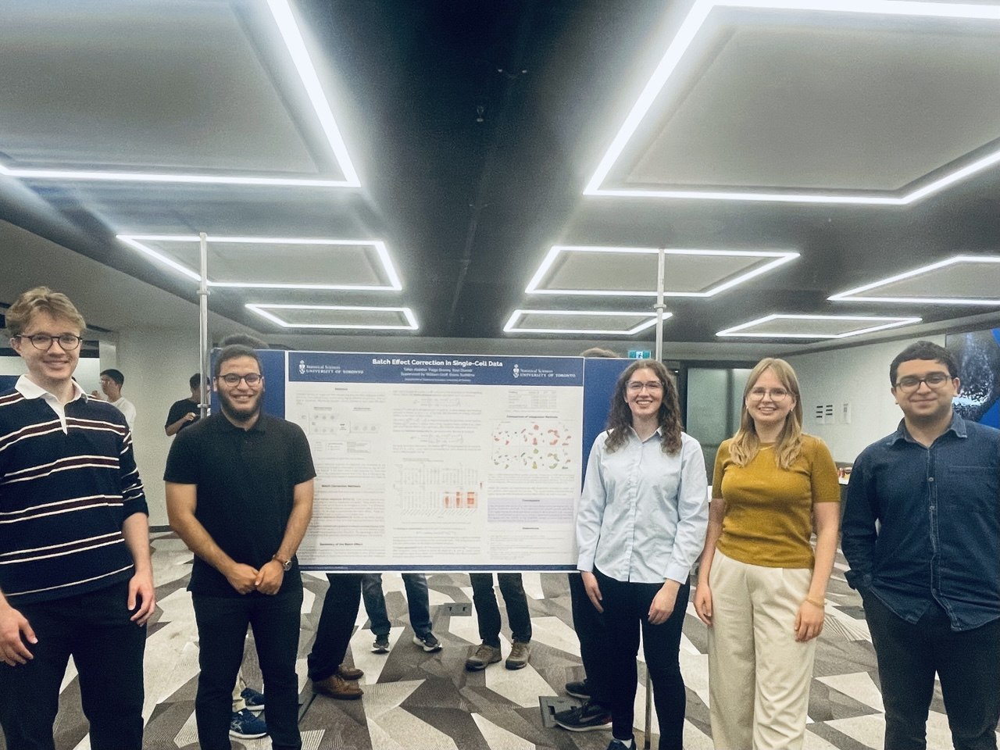
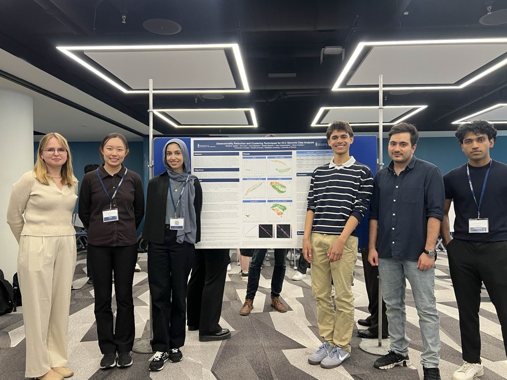

The [University of Toronto Statistical Sciences Research Program (UTSSRP)](https://www.statistics.utoronto.ca/UTSSRP) is a two-week summer research program organized by the Department of Statistical Sciences at the University of Toronto. 
The program introduces undergraduate students to modern statistical research through intensive coursework, faculty seminars, and mentored research projects.

Since 2025, I have served as a **co-organizer** of the program. 
My responsibilities include coordinating the annual program, organizing research seminars, career panels, and student presentations, teaching an intensive short course, and mentoring undergraduate research projects.

#### Short Course

- **2025–2026** — *Curse of Dimensionality*  
  Short course introducing the geometry of high-dimensional spaces, concentration of measure, and the statistical challenges arising in modern high-dimensional data analysis.  
  [Slides](courses/utssrp/high-dimensional data notes.pdf) · [R Tutorial](courses/utssrp/high-dimensional data code.html)

#### Research Project Mentorship

- **2026** — *Batch Effect Correction in Single-Cell Data*  
  Mentored an undergraduate research project investigating the geometry of batch effects in single-cell RNA sequencing data and modern methods for batch effect correction.  

- **2025** — *Heterogeneity of Single-Cell Hi-C Data*  
  Mentored an undergraduate research project on dimension reduction and clustering methods for studying heterogeneity in single-cell Hi-C data.  

### Gallery

 

{width=80% fig-align="left"}  
Research team for the *Batch Effect Correction in Single-Cell Data* proejct (UTSSRP 2026).

 

{width=80% fig-align="left"}  
Research team for the *Heterogeneity of Single-Cell Hi-C Data* project (UTSSRP 2025).

