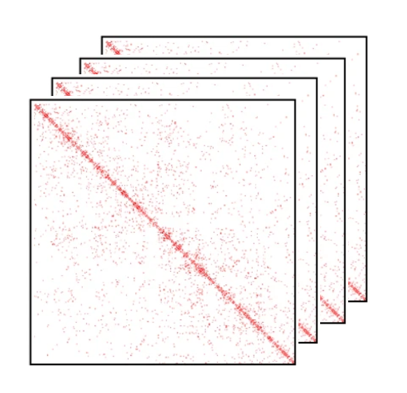
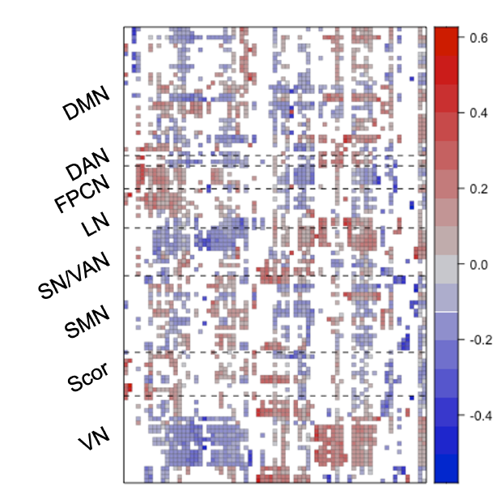
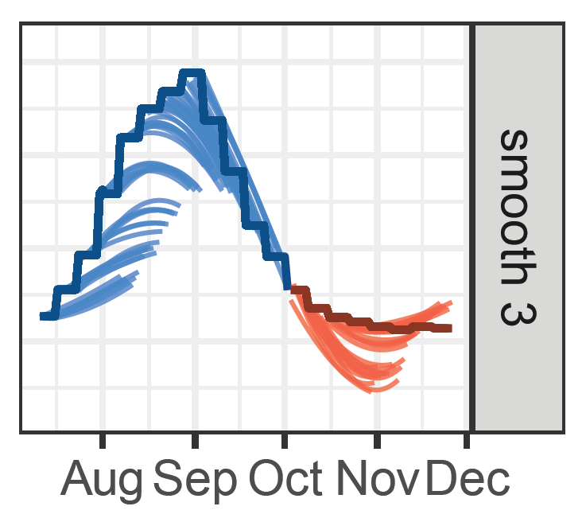
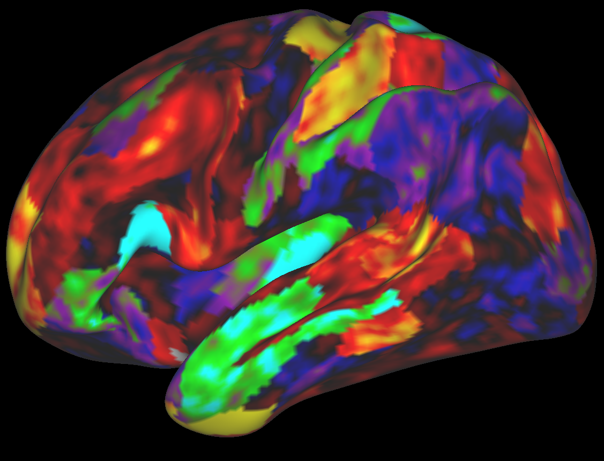
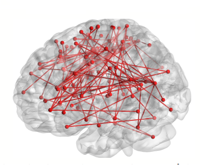

The projects below illustrate several directions of my research, unified by a common goal: developing statistically principled and computationally efficient methods for analyzing complex, high-dimensional data. 
While the motivating applications range from computational genomics to neuroimaging and public health, the underlying themes include dimension reduction, latent variable modeling, and matrix and tensor decomposition.

::: {.project-row}

::: {.project-image}
{fig-alt="Single-cell Hi-C"}
:::

::: {.project-text}

### Zero-inflated Modeling of Single-cell Hi-C Data

::: {.project-meta}
2024–present · University of Toronto
:::

Single-cell Hi-C technologies measure three-dimensional genome organization at single-cell resolution, but the resulting data are extremely sparse, noisy, 
and naturally represented as high-dimensional count tensors. 
Distinguishing true biological absence of chromatin interactions from technical dropout remains one of the major statistical challenges in the analysis of these data.

In this project, we develop a probabilistic framework for **zero-inflated tensor modeling** that combines zero-inflation with low-rank tensor decompositions 
and smooth latent embeddings. 
The proposed methodology identifies structural and technical zeros, imputes missing chromatin contacts, and simultaneously provides a low-dimensional representation of cells and genes for downstream analyses.

**Collaborator:** [Yaoming Zhen](https://sites.google.com/view/yaomingzhen/home)

::: {.project-links}

[Zero-inflated Modeling with Smoothing on Counting Tensors](https://arxiv.org/abs/2604.22088) · [Slides](materials/JSM_2026.pdf)

:::

:::

:::

::: {.project-row}

::: {.project-image}
{fig-alt="Brain connectivity harmonization"}
:::

::: {.project-text}

### Statistical Methods for Harmonization of Brain Connectivity Data

::: {.project-meta}
2024–2026 · University of Toronto
:::

Large neuroimaging studies increasingly combine data collected across multiple scanners and imaging sites, introducing systematic batch effects that can mask meaningful biological variation. 
Existing harmonization methods often ignore the complex network structure of brain connectivity data or remove biologically relevant signal together with technical variation.

This project develops statistical methodology for harmonizing functional connectivity data while preserving scientifically meaningful variation. 
Our recent work introduces **SLACC** (Sparse LAtent Covariate-driven Connectome factorization), a structured latent factor model that represents brain connectivity through sparse 
latent connectivity patterns with covariate-driven subject scores. 

**Collaborators:** [Jun Young Park](https://junjypark.github.io/) and [Rongqian Zhang](https://rongqianzhang-ut.github.io/portfolio/)

::: {.project-links}

[Sparse Covariate-Driven Factorization of High-Dimensional Brain Connectivity with Application to Site Effect Correction](https://arxiv.org/abs/2601.09525) ·
[SLACC package](https://github.com/junjypark/SLACC)

:::

:::

:::

::: {.project-text}

::: {.project-row}

::: {.project-image}
{fig-alt="Canonical correlation analysis"}
:::

::: {.project-text}

### Efficient and Structured Canonical Correlation Analysis

::: {.project-meta}
2023–present · University of Toronto
:::

Canonical correlation analysis (CCA) is one of the fundamental tools for studying relationships between two multivariate datasets. While classical CCA performs well in low-dimensional settings, it becomes statistically inconsistent 
and computationally unstable when the number of variables is comparable to or exceeds the sample size.

This project develops a new perspective on CCA by reformulating the problem as **reduced-rank regression**, leading to computationally efficient algorithms with strong statistical guarantees. 
Building on this framework, we develop methods for sparse, group-sparse, and graph-constrained CCA that remain scalable for modern high-dimensional data while producing interpretable canonical directions.

**Collaborator:** [Claire Donnat](https://donnate.github.io/) and Zixuan Wu

::: {.project-links}

[Canonical Correlation Analysis as Reduced Rank Regression in High Dimensions](https://arxiv.org/abs/2405.19539) ·
[Efficient Canonical Correlation Analysis with Sparsity](https://arxiv.org/abs/2507.11160) ·
[ccar3 package](https://CRAN.R-project.org/package=ccar3) · [Slides](materials/McGill_2026.pdf)

:::

:::

:::

::: {.project-text}

::: {.project-row}

::: {.project-image}
{fig-alt="Chromatin reconstruction"}
:::

::: {.project-text}

### Statistical Methods for 3D Genome Reconstruction

::: {.project-meta}
2018–present · Stanford University & University of Toronto
:::

The three-dimensional organization of the genome plays a central role in gene regulation, cellular differentiation, and disease. 
Advances in chromosome conformation capture technologies, particularly Hi-C, have created unprecedented opportunities to study genome architecture, while simultaneously posing challenging statistical problems due to the high dimensionality, sparsity, and noise of contact matrices.

This research develops statistical methodology for reconstructing chromatin structure from genomic contact data. Our early work introduced **principal curve approaches** for estimating chromosome trajectories in three-dimensional space by 
combining metric scaling with smooth curve estimation. More recently, we generalized this framework to **distribution-based metric scaling**, allowing the reconstruction procedure to accommodate a broad class of probabilistic models—including Poisson, 
zero-inflated Poisson, hurdle Poisson, and negative binomial models.

**Collaborators:** [Trevor Hastie](https://hastie.su.domains/) and [Mark Segal](https://bakarinstitute.ucsf.edu/people-at-bakar/mark)

::: {.project-links}

[Statistical Curve Models for Inferring 3D Chromatin Architecture](https://doi.org/10.1214/24-AOAS1917) ·
[Principal Curve Approaches for Inferring 3D Chromatin Architecture](https://doi.org/10.1093/biostatistics/kxaa046) ·
[DBMS package](https://github.com/ElenaTuzhilina/DBMS) ·
[PoisMS package](https://github.com/ElenaTuzhilina/PoisMS) ·
[PoisMS vignette](https://elenatuzhilina.github.io/PoisMS/) · 
[Slides](materials/PoisMS_slides.pdf) ·
[Poster](materials/PoisMS_poster.pdf)

:::

:::

:::

::: {.project-row}

::: {.project-image}
{fig-alt="Forecasting"}
:::

::: {.project-text}

### Multi-period Forecasting

::: {.project-meta}
2021–2022 · Stanford University
:::

Forecasting is central to many scientific applications, where decision makers often require accurate predictions across multiple future horizons rather than only the next time point. 
Classical forecasting methods typically estimate each prediction horizon independently, ignoring the fact that nearby horizons should often exhibit similar behavior.

In this project, we develop statistical methodology for **multi-period forecasting** by encouraging predictions to vary smoothly across forecast horizons. 
The methodology was motivated by real-time COVID-19 forecasting and formed part of the Stanford and Delphi COVID-19 forecasting effort, where robust long-range predictions were essential for public-health planning.

**Collaborators:** [Trevor Hastie](https://hastie.su.domains/), [Rob Tibshirani](https://tibshirani.su.domains/), [Daniel McDonald](https://dajmcdon.github.io/), and the [Delphi Research Group](https://delphi.cmu.edu/)

::: {.project-links}

[Smooth Multi-Period Forecasting with Application to Prediction of COVID-19 Cases](https://doi.org/10.1080/10618600.2023.2285337) ·
[MPF code](https://github.com/ElenaTuzhilina/MPF) · [Slides](materials/MPF_slides.pdf)

:::

:::

:::

::: {.project-row}

::: {.project-image}
{fig-alt="Weighted low-rank approximation"}
:::

::: {.project-text}

### Weighted Low-Rank Matrix Approximation

::: {.project-meta}
2020–2022 · Stanford University
:::

Low-rank matrix approximation forms the foundation of numerous statistical and machine learning methods, including principal component analysis, recommender systems, and matrix completion. 
In many applications, however, different matrix entries carry different levels of uncertainty or importance, naturally leading to weighted formulations.

This project develops optimization algorithms for **weighted low-rank matrix approximation**, including both rank-constrained estimators and nuclear-norm relaxations. 
We propose accelerated proximal-gradient algorithms with Nesterov and Anderson acceleration together with scalable alternating least-squares methods suitable for high-dimensional problems. 

**Collaborator:** [Trevor Hastie](https://hastie.su.domains/)

::: {.project-links}

[Weighted Low-Rank Matrix Approximation and Acceleration](https://arxiv.org/abs/2109.11057) ·
[WLRMA package](https://github.com/ElenaTuzhilina/WLRMA)

:::

:::

:::

::: {.project-row}

::: {.project-image}
{fig-alt="Structured CCA"}
:::

::: {.project-text}

### Canonical Correlation Analysis with Structured Regularization

::: {.project-meta}
2020–2022 · Stanford University
:::

Canonical correlation analysis is one of the most widely used tools for studying relationships between two sets of variables. 
Classical regularized CCA methods, however, typically assume that all variables are independent and ignore valuable prior information such as spatial, temporal, or biological structure.

This project develops structured regularization techniques for canonical correlation analysis by incorporating feature-specific information directly into the estimation procedure. 
We propose several regularization strategies including group and partially regularized penalties that improve interpretability and statistical efficiency in high-dimensional settings. 

**Collaborators:** [Trevor Hastie](https://hastie.su.domains/) and Leonardo Tozzi

::: {.project-links}

[Canonical Correlation Analysis in High Dimensions with Structured Regularization](https://journals.sagepub.com/doi/10.1177/1471082X211041033) ·
[RCCA package](https://github.com/ElenaTuzhilina/RCCA) · 
[Slides](materials/MU_presentation.pdf) ·
[Poster](materials/NRC_poster.pdf)

:::

:::

:::

::: {.project-row}

::: {.project-image}
{fig-alt="Human Connectome Project"}
:::

::: {.project-text}

### Statistical Analysis of Functional Brain Connectivity

::: {.project-meta}
2018–2022 · Stanford University
:::

Understanding how large-scale brain networks relate to cognition and mental health is one of the central challenges of modern neuroscience. 
Functional MRI provides measurements of whole-brain connectivity, but the resulting datasets are extremely high-dimensional and require specialized statistical methodology to uncover meaningful associations with behavioral and clinical outcomes.

As part of the **Connectomes for Emotional Disorders** project at Stanford, we developed statistical methods for relating functional connectivity networks to measures of emotional well-being using structured canonical correlation analysis. 

**Collaborators:** [Trevor Hastie](https://hastie.su.domains/), Leonardo Tozzi, [Leanne Williams](https://www.med.stanford.edu/profiles/leanne-williams), and [the Stanford Williams PanLab](https://www.stanfordpmhw.com/panlab)

::: {.project-links}

[Relating Whole-Brain Functional Connectivity to Self-Reported Negative Emotion in a Large Sample of Young Adults Using Group-Regularized Canonical Correlation Analysis](https://doi.org/10.1016/j.neuroimage.2021.118137) ·
[Code](https://github.com/ElenaTuzhilina/Connectome) ·
[Poster](materials/Connectome_poster.pdf)

:::

:::

:::