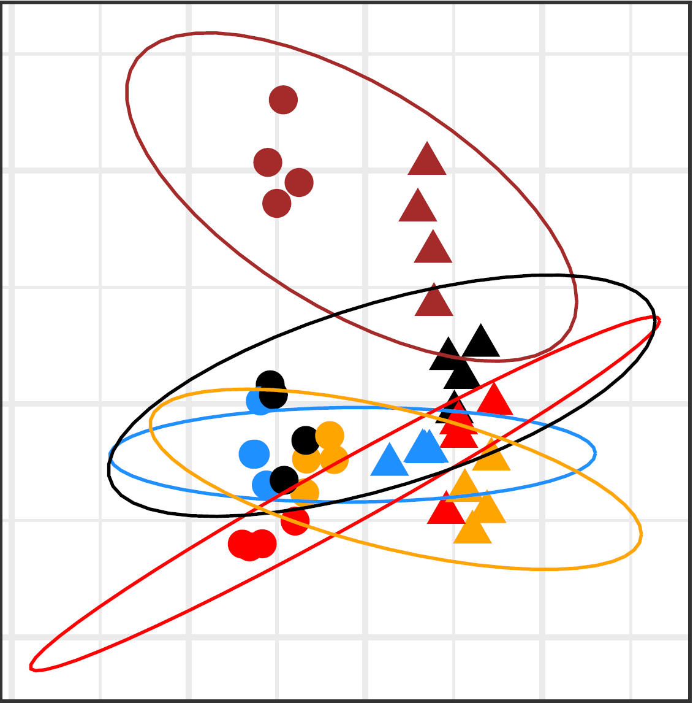
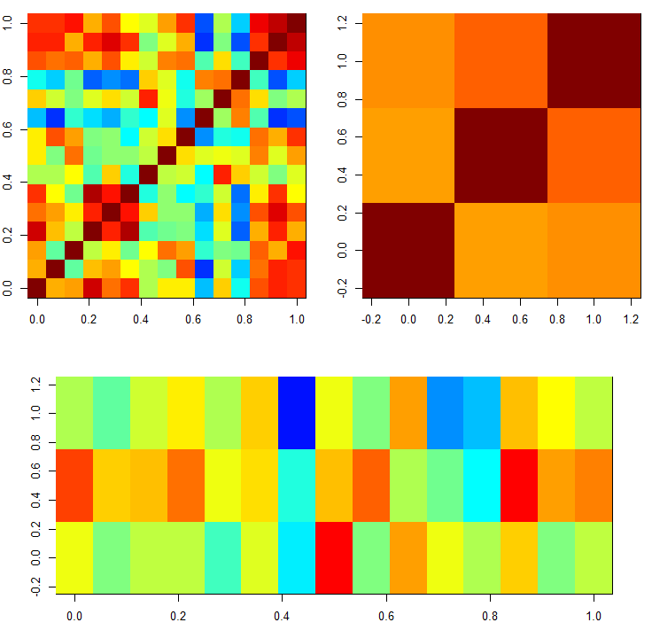
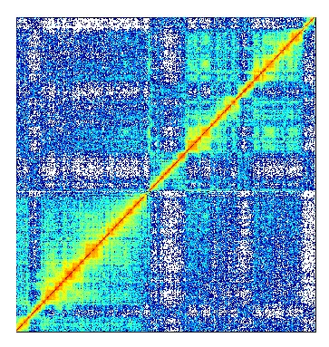
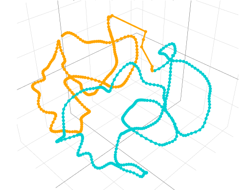
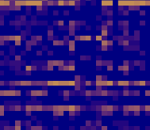

This page collects software developed for my recent papers.

### Structured Canonical Correlation Analysis

#### eccar3 (R package)

:::: {.columns}

::: {.column width="22%"}
::: {.mt-2}
{width=90% fig-align="center"}
:::
:::

::: {.column width="78%"}

The `eccar3` package implements canonical correlation analysis through a reduced-rank regression framework. It is designed for high-dimensional settings and supports structured regularization, model selection, and cross-validation.

The package includes `cca_rrr()` for settings in which one data view is high-dimensional and the other is low-dimensional, as well as `ecca()` for settings in which both data views are high-dimensional. Available penalties include standard $\ell_1$ regularization, group-lasso regularization, and total-variation regularization for variables with a known graph structure.

[GitHub](https://github.com/donnate/ccar3/tree/main) · [Paper 1](https://arxiv.org/abs/2405.19539) · [Paper 2](https://arxiv.org/abs/2507.11160)

:::

::::

#### RCCA (R package)

:::: {.columns}

::: {.column width="22%"}
::: {.mt-2}
{width=90% fig-align="center"}
:::
:::

::: {.column width="78%"}

The `RCCA` package implements regularized canonical correlation analysis with structured penalties. It includes three regularization approaches: standard $\ell_2$ regularization, partial $\ell_2$ regularization, and a group penalty for controlling sparsity in high-dimensional settings.

[GitHub](https://github.com/ElenaTuzhilina/RCCA) · [Paper](https://journals.sagepub.com/doi/10.1177/1471082X211041033)

:::

::::

### Chromatin 3D Reconstruction

#### DBMS (R package)

:::: {.columns}

::: {.column width="22%"}
::: {.mt-2}
{width=90% fig-align="center"}
:::
:::

::: {.column width="78%"}

The `DBMS` package implements distribution-based metric scaling for 3D chromatin reconstruction. It generalizes PoisMS by supporting several probabilistic models for chromatin contact matrices, including Poisson, zero-inflated Poisson, hurdle Poisson, and negative-binomial models.

The package also supports smooth curve estimation through basis control, such as B-splines, and roughness penalization, such as smoothing splines.

[GitHub](https://github.com/ElenaTuzhilina/DBMS) · [Paper](https://doi.org/10.1093/biomtc/ujae108)

:::

::::

#### PoisMS (R package)

:::: {.columns}

::: {.column width="22%"}
::: {.mt-2}
{width=90% fig-align="center"}
:::
:::

::: {.column width="78%"}

The `PoisMS` package implements statistical curve-based methods for 3D chromatin reconstruction from contact matrices. It includes three approaches: principal curve metric scaling (PCMS), inspired by classical multidimensional scaling; weighted PCMS (WPCMS), which controls the influence of individual matrix entries; and Poisson metric scaling (PoisMS), which models contact counts using a Poisson distribution.

[GitHub](https://github.com/ElenaTuzhilina/PoisMS) · [Vignette](https://elenatuzhilina.github.io/PoisMS/) · [Paper](https://doi.org/10.1093/bioinformatics/btab374)

:::

::::

### Low-Rank Matrix Approximation

#### WLRMA (R package)

:::: {.columns}

::: {.column width="22%"}
::: {.mt-2}
{width=90% fig-align="center"}
:::
:::

::: {.column width="78%"}

The `WLRMA` package implements weighted low-rank matrix approximation for structured data. It solves rank-constrained optimization problems and their nuclear-norm relaxations using proximal gradient descent with Nesterov and Anderson acceleration. The package also includes a weighted alternating least-squares implementation for high-dimensional matrices.

[GitHub](https://github.com/ElenaTuzhilina/WLRMA) · [Paper](https://arxiv.org/abs/2109.11057)

:::

::::